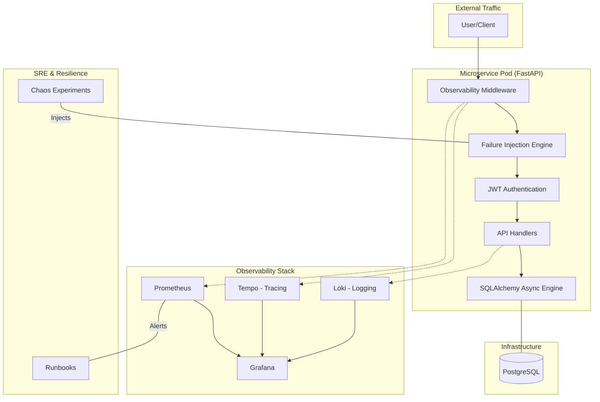

# SRE Observability & Incident Readiness Platform

This repository contains a production-grade, failure-aware microservice system designed with **Site Reliability Engineering (SRE)** principles at its core. It is not just a functional application; it is a platform built to be observable, measurable, alertable, and recoverable.

## 🏗️ Architecture & Component Flow



## 🚀 Key Features

*   **Failure-Aware Application**: FastAPI microservice with built-in failure injection (latency, errors, memory leaks).
*   **Full Observability Stack**:
    *   **Prometheus**: Metrics collection and SLA-based alerting.
    *   **Grafana**: "Golden Signals" dashboards for real-time monitoring.
    *   **Loki**: Structured JSON log aggregation.
    *   **Tempo**: Distributed tracing for request profiling.
*   **Production-Grade Features**:
    *   **Persistent Storage**: PostgreSQL integration with async SQLAlchemy for reliable data storage.
    *   **Secure Access**: JWT-based authentication for protecting API resources.
    *   **Asynchronous Processing**: Background tasks for handling long-running operations.
    *   **Robust Config**: Environment-driven settings using Pydantic.
*   **Production Infrastructure**: Kubernetes manifests with HPA, PDB, and graceful shutdown handling.
*   **Helm Powered**: Template-based deployments for multi-environment support.
*   **Chaos Engineering**: Pre-defined experiments to validate system resilience.
*   **Incident Response**: Integrated runbooks and blameless postmortem templates.
*   **Automation**: GitHub Actions pipeline for linting, security scanning, and deployment.

## 📁 Repository Structure

```text
SRE-Observability-Incident-Readiness/
├── app/             # FastAPI Microservice (Python) - Modularized
├── docker/          # Multi-stage Dockerfile
├── k8s/             # Raw Kubernetes manifests
├── helm/            # Helm chart with PostgreSQL dependency
├── monitoring/      # Updated Observability stack (new DB metrics)
├── chaos/           # New Database failure experiments
├── runbooks/        # Updated with Database recovery steps
├── postmortems/     # Post-incident analysis examples
├── ci-cd/           # CI/CD pipeline definitions
├── docker-compose.yaml # NEW: One-click local dev environment
└── README.md        # This file
```

## 🛠️ Getting Started

### 1. Run Locally (Docker Compose) - NEW 🚀

The easiest way to see everything in action:

```bash
docker-compose up --build
```

This starts:
- The Microservice
- PostgreSQL
- Prometheus
- Grafana
- Tempo (Tracing)

### 2. Manual Testing

*   **Register**: `POST http://localhost:8000/api/auth/register` (JSON body: `{"username": "test", "email": "test@example.com", "password": "password"}`)
*   **Get Token**: `POST http://localhost:8000/api/auth/token` (Form data: `username=test`, `password=password`)
*   **Create Resource**: `POST http://localhost:8000/api/resource` (Include Bearer token, JSON: `{"name": "test-resource", "value": 10.5}`)
*   **Ready Check**: `http://localhost:8000/ready` (Verifies DB connection)

### 3. Monitoring Access

*   **Metrics**: `http://localhost:8000/metrics`
*   **Grafana**: `http://grafana:3000` (Import `monitoring/grafana/golden_signals.json`)
*   **Loki**: `http://loki:3100`

## 📖 Operational Documentation

Every alert in this system is linked to a specific runbook:

*   [High Latency](runbooks/high-latency.md)
*   [High Error Rate](runbooks/high-error-rate.md)
*   [Memory Leak](runbooks/memory-leak.md)

Explore our [Example Postmortem](postmortems/2026-02-12-latency-spike.md) to understand our blameless culture.

## 🧪 Chaos Engineering

Explore the new `Database Connection Failure` experiment in `chaos/experiments.yml`.
